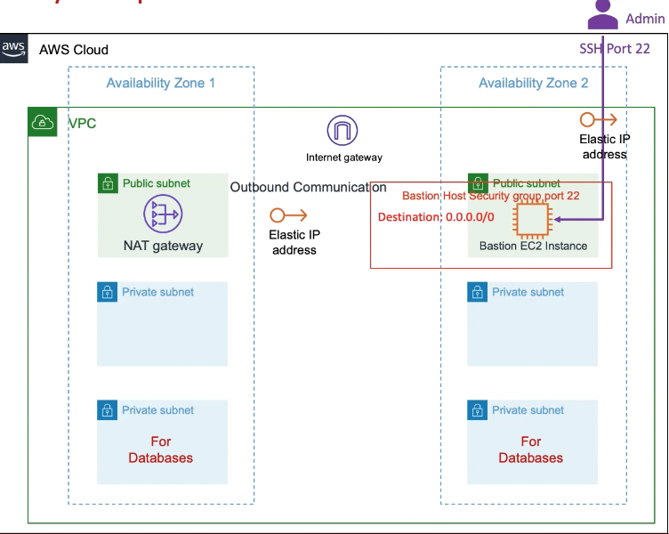

1. For VPC switch Availability Zones from Static to Dynamic using Datasource `aws_availability_zones`
2. Create EC2 Key pair that will be used for connecting to Bastion Host and EKS Node Group EC2 VM Instances
3. EC2 Bastion Host - [Terraform Input Variables](https://www.terraform.io/docs/language/values/variables.html)
4. EC2 Bastion Host - [AWS Security Group Terraform Module](https://registry.terraform.io/modules/terraform-aws-modules/security-group/aws/latest)
5. EC2 Bastion Host - [AWS AMI Datasource](https://registry.terraform.io/providers/hashicorp/aws/latest/docs/data-sources/ami) (Dynamically lookup the latest Amazon2 Linux AMI)
6. EC2 Bastion Host - [AWS EC2 Instance Terraform Module](https://registry.terraform.io/modules/terraform-aws-modules/ec2-instance/aws/latest)
7. EC2 Bastion Host - [Terraform Resource AWS EC2 Elastic IP](https://registry.terraform.io/providers/hashicorp/aws/latest/docs/resources/eip)
8. EC2 Bastion Host - [Terraform Provisioners](https://www.terraform.io/docs/language/resources/provisioners/syntax.html)
   - [File provisioner](https://www.terraform.io/docs/language/resources/provisioners/file.html)
   - [remote-exec provisioner](https://www.terraform.io/docs/language/resources/provisioners/local-exec.html)
   - [local-exec provisioner](https://www.terraform.io/docs/language/resources/provisioners/remote-exec.html)
9. EC2 Bastion Host - [Output Values](https://www.terraform.io/docs/language/values/outputs.html)
10. EC2 Bastion Host - ec2bastion.auto.tfvars
11. EKS Input Variables
12. EKS [Local Values](https://www.terraform.io/docs/language/values/locals.html)
13. EKS Tags in VPC for Public and Private Subnets
14. Execute Terraform Commands and Test
15. Elastic IP - [depends_on Meta Argument](https://www.terraform.io/docs/language/meta-arguments/depends_on.html)
